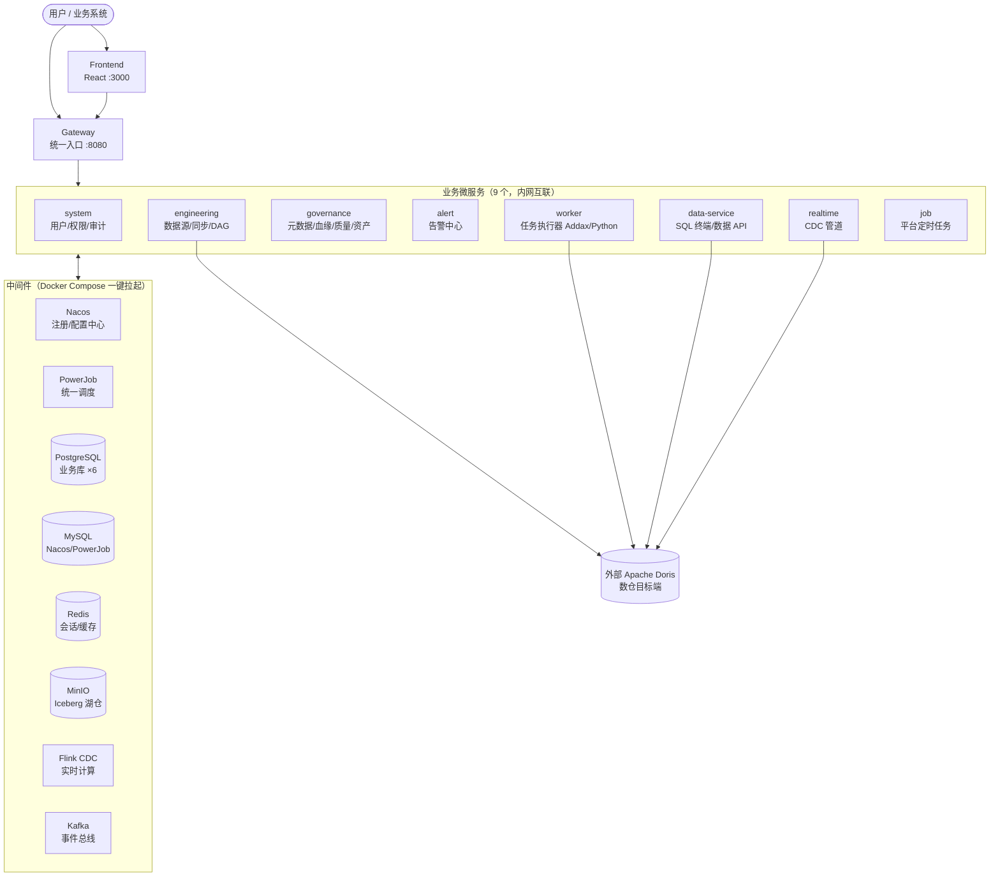

<div align="center">

# DataNest

**开源一站式数据中台 —— 接数据、管资产、做治理、对外服务，一个平台完成**

[](LICENSE)
[](https://github.com/jiezais88/DataNest/releases/latest)
[](https://adoptium.net/temurin/releases/?version=25)
[](https://spring.io/projects/spring-boot)
[](https://react.dev/)

[快速开始](#快速开始) • [部署文档](docs/deploy.md) • [架构](#架构) • [能力全景](#能力全景) • [变更记录](CHANGELOG.md)

</div>

---

## 为什么是 DataNest

数据团队的日常工具链往往是碎片化的：同步用一个工具、调度用一个、血缘/质量又是另外几个，平台之间账号不通、元数据不通、告警不通。想把「从接入到消费」的全链路管起来，要么买昂贵的商业中台，要么自己拼装五六个开源组件并忍受集成成本。

**DataNest 把这条链路收进一个平台**：数据源接入 → 元数据采集 → 批量同步 → DAG 编排调度 → 血缘/质量/标准治理 → 资产目录 → 实时 CDC → 数据服务（SQL 终端 + 数据 API），再配齐平台级的审计日志、细粒度 RBAC 与执行队列。一条命令本地起全栈，适合中小数据团队快速落地，也适合作为学习现代数据中台架构的参考实现。

### 差异化

- **🧩 真一体化**：不是组件拼装——元数据、血缘、质量、权限在统一模型下互相联动（如同步完成自动更新元数据、质量规则直接挂在资产上、权限贯穿 SQL 终端/资产/同步/API 四个入口）
- **🚀 一条命令跑起来**：`deploy.sh` 完成环境预检、构建、启动、健康检查与登录冒烟，15~30 分钟从克隆到可用
- **🏗️ 现代微服务架构**：Java 25 + Spring Boot 4 云原生微服务，PowerJob 统一调度，Flink CDC 实时链路，代码即架构文档
- **🔐 平台级安全内置**：审计日志、自定义角色 + 数据源/库/表三级数据权限、机密表锁定，不是后补的
- **📦 轻依赖**：仅需 Docker 与一个外部 Doris（数仓目标端），无 Kubernetes 等重型前置

## 架构



- 跨服务调用一律走 Feign 契约（`/internal/**` + 内部令牌），读路径降级、写路径 fail-closed
- 所有调度（DAG 工作流 + 平台定时任务）收敛到 PowerJob；DAG 支持执行队列（并发上限 + 优先级）
- 实时链路：MySQL Binlog / PG 逻辑复制 → Flink CDC → Iceberg（MinIO）→ Doris

## 能力全景

### 🔌 数据工程

- **数据源连接**：MySQL / PostgreSQL / Doris / Oracle / SQL Server，密码 AES 加密存储、前端脱敏
- **批量数据同步**：Addax 全量/增量同步（多表字段映射、速率限流）→ Doris Stream Load，执行历史与日志可查
- **DAG 可视化编排**：ReactFlow 拖拽画布 + Monaco SQL 编辑器；SQL / Python / 条件分支 / 子 DAG 节点；参数化；版本快照、对比与回滚；失败节点重跑
- **执行队列**：队列并发上限 + 高/中/低优先级排队调度，cron 定时与手动触发统一走排队链路

### 🛡️ 数据治理

- **元数据**：自动采集（全量/增量、Cron 定时），数据源 → 库 → 表 → 字段树形浏览，注释可编辑
- **血缘**：SQL AST 自动解析上报，表级图谱 + 字段级下钻，影响分析 / 溯源分析
- **数据质量**：完整性/唯一性/值域/自定义 SQL（含 Python）规则，四档判定、趋势与质量报告
- **数据标准**：命名规范、字段类型标准、合规自动扫描

### 📚 资产目录

- 关键词搜索、按数据域/主题浏览、数据详情聚合（血缘 + 质量评分 + 数据预览）
- 标签、收藏、关注、评论、热度协作能力

### ⚡ 实时计算

- **CDC 管道**：MySQL Binlog / PostgreSQL 逻辑复制 → Flink CDC → Iceberg 湖仓（MinIO）→ Doris，配置向导式建管
- **可观测**：吞吐/延迟指标历史与趋势、Checkpoint/Savepoint 可视可管、流处理邮件告警

### 🌐 数据服务

- **SQL 查询终端**：Doris JDBC 直连，结果导出 CSV/Excel
- **数据 API**：基于表一键生成 RESTful API，API Key 认证、限流、熔断、调用统计
- **实时订阅**：CDC 变更事件 WebSocket 推送
- **数据分级分类**：机密数据访问管控，不出中台

### 🔐 平台安全与运维

- **审计日志**：用户/数据源/同步/DAG/SQL/API 等 10 类操作全量留痕，90 天保留，只增不改
- **细粒度 RBAC**：自定义角色 + 88 个功能权限点 + 数据源/库/表三级数据权限，机密表锁定，保存即时生效
- **首页仪表盘**：值班态势总览（症状 KPI、待处理异常队列、系统健康、14 日趋势）
- **告警中心**：DAG/同步/采集/质量/CDC 统一邮件告警规则与发送历史
- **配置热更新**：Nacos 业务参数热生效，调度 cron 热重注册

## 快速开始

```bash
git clone https://github.com/jiezais88/DataNest.git
cd DataNest/data-nest
./deploy.sh
```

一条命令完成环境预检、构建与全栈启动；完成后访问 `http://localhost:3000`（admin / admin123）。

- **环境要求**：Docker + Compose v2、JDK 25、Maven 3.9+、Node 18+、pnpm（内存建议 ≥16GB；Windows 请用 Git Bash）
- 同步/数仓功能需要外部 Apache Doris（配置指引见部署文档）
- 首次执行自动从 GitHub Release 下载 Flink CDC 运行时 jar（约 182MB，sha256 校验）
- **完整部署文档（Doris 配置、端口清单、FAQ、卸载）：[docs/deploy.md](docs/deploy.md)**

## 技术栈

| 层级 | 技术 |
|------|------|
| 后端 | Java 25、Spring Boot 4.x、Spring Cloud + Spring Cloud Alibaba（微服务 + Feign） |
| 网关与鉴权 | Spring Cloud Gateway、Sa-Token、JWT |
| ORM 与迁移 | MyBatis-Plus、Flyway |
| 注册/配置中心 | Nacos 3.1.1（支持业务参数热更新） |
| 任务调度 | PowerJob 5.1.2（平台定时任务 + DAG 工作流） |
| 数据同步 | Addax 6.0.11 → Doris Stream Load |
| 实时链路 | Flink 2.2.1 + Flink CDC 3.6.0、Apache Iceberg、Kafka 4.0.0 |
| 存储 | PostgreSQL 16（业务库 ×6）、MySQL 8.0（Nacos/PowerJob）、Redis 7、MinIO |
| 数仓 | Apache Doris（外部部署，需自备） |
| 前端 | React 18、TypeScript、Vite、Tailwind CSS、ReactFlow 11、Monaco Editor、pnpm |
| 部署 | Docker + Docker Compose（一键部署脚本） |

## 仓库结构

```
├── docs/                        # 产品/架构/部署文档与各 Sprint 文档
│   ├── deploy.md                # 部署指南（先读这个）
│   ├── DataNest-产品规格文档-v1.0.md
│   └── DataNest-技术架构文档-v1.0.md
│
└── data-nest/                   # 工程代码（Maven 多模块 + 前端）
    ├── deploy.sh                # 一键部署脚本
    ├── docker-compose.yml       # 全栈编排（中间件 + 9 个微服务 + 前端）
    ├── shared-configs/          # Nacos 共享配置（shared-*.yaml）
    ├── scripts/                 # 数据库初始化、Flink 依赖拉取等脚本
    ├── docker/                  # 各服务 Dockerfile
    │
    ├── data-nest-libs/          # 共享库：common（通用能力）、task-core（DAG/执行内核）
    ├── data-nest-apis/          # Feign 契约（system/engineering/governance/alert/realtime/data-service）
    ├── data-nest-services/      # 可部署服务：gateway / system / engineering / governance /
    │                            #   alert / realtime / data-service / worker / job
    └── data-nest-frontend/      # React 前端（pnpm + Vite）
```

## 文档

- 部署指南：[docs/deploy.md](docs/deploy.md)
- 产品总纲：[docs/DataNest-产品规格文档-v1.0.md](docs/DataNest-产品规格文档-v1.0.md)
- 架构总纲：[docs/DataNest-技术架构文档-v1.0.md](docs/DataNest-技术架构文档-v1.0.md)
- 变更记录：[CHANGELOG.md](CHANGELOG.md)
- 各 Sprint PRD / 技术文档：`docs/sprint*/`（完整记录 12 个 Sprint 的决策与实现）

## 贡献

欢迎通过 [Issues](https://github.com/jiezais88/DataNest/issues) 反馈问题与建议。代码结构清晰、文档完整（每个能力域都有对应 Sprint 的 PRD 与技术文档），是很好的数据中台架构学习与二次开发基座。

## License

[Apache-2.0](LICENSE) © DataNest Contributors

> 仓库内的账号密码（admin123、datanest123 等）均为**本地开发默认值**，生产环境部署必须修改。
