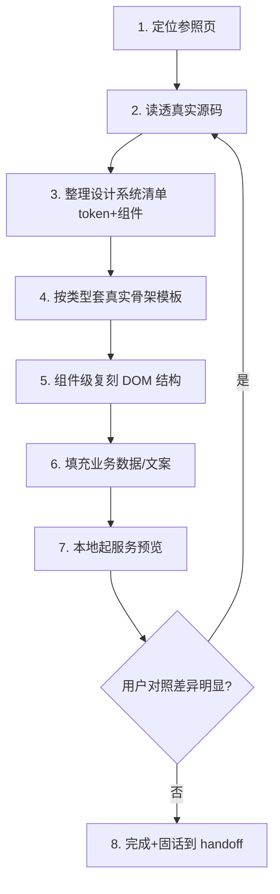

# DataNest UI 原型高保真制作规范

> 本文件固化「AI-UI 输出高保真原型」的方法论与真实 token 速查表。
> 目标：让用户满意（视觉/交互几乎等同真系统）+ 让 AI 前端可还原（每个细节可溯源到真实代码）。
> 适用：`docs/sprint*/DataNest-Sprint*-原型.{html,css,js}` 这类静态高保真原型。

## 1. 核心原则：不"画"原型，要"抄"真实前端

原型的本质是**用真实前端的设计系统搭一个静态 HTML**，每个 token、组件、图标、antd 结构、骨架模板都必须能在真实代码里找到出处。

**不要凭记忆/印象配色、造结构**。之前"颜色像了但布局丑"的根因就是：只抄了颜色，没抄组件 DOM 结构和像素排版。

### 输出物 = 真实前端结构 + 原型壳子
- **用户看到**：跟真系统视觉/交互几乎一致的可点击原型 → 满意
- **AI 前端看到**：一份"高保真 + 可溯源"蓝图 → 照着还原即可

## 2. 工作流程（避免返工）



### 第 1 步：先选"参照页面"，不凭空造
要做的原型页一定能找到同类真实页面作为范本：
- **列表页** → 参照 `quality-templates/index.tsx`、`data-quality/index.tsx`
- **左树右表页** → 参照 `metadata/index.tsx`
- **详情页** → 参照 `metadata/index.tsx` 的 `renderTableDetail`
- **表单页/弹窗** → 参照各 `Drawer` / `DsModal`

**这一步决定 80% 的结构正确性。**

### 第 2 步：读透参照页 + 所有用到的组件
不只读页面文件，还要读它 import 的所有 `Ds*` 组件、`tokens.css`、`tailwind.config.js`。**token 的精确像素值都在 tailwind.config.js**，颜色在 tokens.css。

### 第 3 步：整理设计系统清单
把读到的真实值整理成清单（见 §4 速查表），逐项对照，不要猜。

## 3. 高保真五要素（缺一不可）

1. **颜色/圆角/阴影/字号**：全部取 `tokens.css` 的 `--color-*` + `tailwind.config.js` 的 `ds-*` 真实值。**accent 主色是 indigo `#4f46e5`，不是 blue `#1d4ed8`**（历史最大的坑）。
2. **复用真实组件**：`DsButton`/`DsToolbar`/`DsStatusBadge`/`DsFilterSelect`/`SearchInput`/`Pagination`/`QualityScoreBadge` 等，复刻它们的真实 DOM + class。
3. **图标一律 HeroIcons outline SVG**：`react-icons/hi2`，`stroke-width:1.5`、`stroke-linecap/linejoin=round`，**禁 emoji**。
4. **复刻 antd Table/Tabs/Modal 真实 class 结构**：`.ant-table`/`.ant-tabs-nav`/`.ant-tabs-ink-bar` 等，不自己造简化结构。
5. **按类型套真实骨架模板**：列表页/左树右表/详情页/表单页，先选对参照页再动手。

## 4. 真实 token 速查表（对齐 2026-08-05 代码）

> 这些值来自 `src/styles/tokens.css` + `tailwind.config.js`，是**唯一权威来源**。改前先重新读这两个文件，勿照抄本文档旧值。

### 4.1 颜色（RGB → hex）

| token | RGB | hex | 说明 |
|-------|-----|-----|------|
| `--color-bg-root` | `238 240 247` | `#eef0f7` | 页面底/表头底 |
| `--color-bg-surface` | `255 255 255` | `#ffffff` | 卡片/弹窗 |
| `--color-bg-hover` | `235 239 246` | `#ebeff6` | 行/项 hover |
| `--color-border-subtle` | `216 222 232` | `#d8dee8` | 主要边框 |
| `--color-border-strong` | `198 206 218` | `#c6ceda` | 按钮 hover 边框 |
| `--color-text-primary` | `15 23 42` | `#0f172a` | 主文字 |
| `--color-text-secondary` | `71 85 105` | `#475569` | 次文字/表头 |
| `--color-text-muted` | `100 116 139` | `#64748b` | 辅助文字（WCAG 提亮后）|
| **`--color-accent`** | `79 70 229` | **`#4f46e5`** | **indigo 主色** |
| `--color-accent-hover` | `67 56 202` | `#4338ca` | |
| `--color-accent-light` | `238 242 255` | `#eef2ff` | accent 浅底 |
| `--color-danger` | `220 38 38` | `#dc2626` | |
| `--color-danger-light` | `254 242 242` | `#fef2f2` | |
| `--color-success` | `22 163 74` | `#16a34a` | |
| `--color-success-light` | `240 253 244` | `#f0fdf4` | |
| `--color-warning` | `217 119 6` | `#d97706` | |
| `--color-warning-light` | `255 251 235` | `#fffbeb` | |

### 4.2 侧边栏（深色，slate-700 中等深）

| token | hex | 说明 |
|-------|-----|------|
| `--color-sidebar-bg` | `#334155` | **slate-700，非近黑** |
| `--color-sidebar-border` | `#475569` | slate-600 |
| `--color-sidebar-text` | `#cbd5e1` | slate-300 |
| `--color-sidebar-hover` | `#475569` | |
| `--color-sidebar-active` | `#4f46e5` | active 用 `bg-accent/25 text-white` |

### 4.3 圆角 / 阴影 / 间距 / 字号

| token | 值 |
|-------|-----|
| `rounded-ds-sm` | **8px** |
| `rounded-ds-md` | **12px** |
| `rounded-ds-lg` | **16px** |
| `rounded-ds-xs` | 6px |
| `shadow-ds-xs` | `0 1px 2px rgba(0,0,0,0.06)` |
| `shadow-ds-sm` | `0 1px 3px rgba(0,0,0,.08),0 1px 2px rgba(0,0,0,.05)` |
| 间距 `ds-1/2/3/4/5/6/8` | 4/8/12/16/20/24/32px |
| `text-ds-display` | `1.5rem`(24px) 800 `-0.5px` |
| `text-ds-heading` | `1.25rem`(20px) 700 `-0.3px` |
| `text-ds-subhead` | `1.0625rem`(17px) 700 |
| `text-ds-body` | `0.875rem`(14px) 400 lh 1.6 |
| `text-ds-small` | `0.8125rem`(13px) 500 lh 1.5 |
| `text-ds-caption` | `0.75rem`(12px) 600 `0.6px` |
| `text-ds-badge` | `11px` 600 lh 1.4 |
| `text-ds-nano` | `0.6875rem`(11px) 600 `1px` |

### 4.4 关键组件样式（精确值）

| 组件 | 真实 class | 要点 |
|------|-----------|------|
| `DsButton` | `px-ds-4 py-ds-2 text-ds-small font-semibold rounded-ds-sm` | 16px 8px / 13px 600 / radius 8px |
| `DsToolbar` | `p-ds-3 border-b gap-ds-3 flex-wrap` | padding 12px |
| `SearchInput` | `min-w-[240px] max-w-[360px] py-[9px] bg-ds-bg-root` | **底是 bg-root 浅灰**，icon left-12px |
| `DsFilterSelect` | `min-w-[140px] pl-ds-3 pr-9 py-ds-2 bg-white` | chevron 是 `HiChevronRight rotate-90` |
| `DsStatusBadge` | `px-2.5 py-1 rounded-full text-ds-badge` | 10px 4px / 11px / dot 6px；disabled/accent 无 dot |
| `QualityScoreBadge` 表格模式 | `数字(text-ds-small bold) + 胶囊(text-11px)` | 两段式，中文标签（良好/优秀/一般/差）|
| `Pagination` | 左「共N条/每页」右页码 `justify-between` | 数字钮无边框，active `bg-accent` |
| antd Table 表头 | `bg-root 11px uppercase ls-0.5px 2px 底边框` | thead padding `10px 16px` |
| antd Table 行 | padding `10px 16px` 1px 底边框 | 紧凑，hover bg-hover |

## 5. 页面骨架模板

### 列表页（最常用）
```
<div page-head>  <h1 text-ds-display>标题</h1> + 副标题(text-ds-small muted)
                 <DsButton primary>新增</DsButton>
</div>
<div table-card(bg-surface rounded-md shadow-xs border)>   ← 白卡片
  <div card-toolbar(p-3 border-b)>  SearchInput + 筛选 + (ml-auto)查询/重置 </div>
  <antd Table prototype-table prototype-table-flush>
  <Pagination>
</div>
```

### 左树右表页（元数据/资产分类）
```
<div layout-split(flex gap-16px)>
  <div tree-panel(width 260)> 树（节点 py-7px, active=accent-light + 左竖条）</div>
  <div table-card> 表格 </div>
</div>
```

### 详情页
`Breadcrumb` → 顶部路径 → antd Tabs（基础信息/字段/血缘/质量）

## 6. 验收流程

1. 本地起静态服务：`cd docs/sprint<N> && python -m http.server 8899`（后台：`Start-Process python -m http.server 8899 -WorkingDirectory <path> -WindowStyle Hidden`）
2. 用 `preview_url` 打开，或用 §7 的 Playwright 脚本自动截图对比
3. **逐屏对照真实前端**（`localhost:8080` 或截图），重点看：
   - 间距/留白、表格行高/表头/hover、图标风格统一（无 emoji）
   - 页签激活态、按钮圆角、弹窗遮罩、侧边栏配色
4. 差异明显 → 回到参照页重新读源码，按 §4 逐项核对
5. 完成后在 `handoff/sprint-N.md` 记录变更清单与对齐要点

> **注意**：不要仅凭编译/无 lint 报错就宣称完成。务必视觉对照过真实前端（手动或自动截图）。

## 7. 自动化截图对比（推荐）

环境若装了 Python Playwright（`python -m playwright --version`），可以直接自动化截图真实前端 + 原型，逐屏对比。核心要点（可自行组装成脚本）：

```python
# 1) 通过登录 UI 完成认证（最稳，避免 localStorage 注入时机问题）
ctx = browser.new_context(viewport={"width": 1440, "height": 900})
page = ctx.new_page()
page.goto(f"{FRONT_URL}/login", wait_until="networkidle")
page.fill('input[placeholder*="用户名"]', "admin")
page.fill('input[placeholder*="密码"]', "admin123")
page.locator('input[placeholder*="密码"]').press("Enter")  # 触发 type=submit
page.wait_for_url(lambda u: "/login" not in u, timeout=20000)

# 2) 访问目标路由截图
page.goto(f"{FRONT_URL}/governance/quality-templates", wait_until="networkidle")
page.wait_for_timeout(2000)
page.screenshot(path=OUT_DIR + "real.png")

# 3) 切到原型对应视图（通过 prototype-switch 按钮的 data-view 属性）
page.goto(PROTO_URL, wait_until="networkidle")
page.evaluate("""(name) => {
    document.querySelectorAll('.prototype-switch button').forEach((b) => {
        if (b.getAttribute('data-view') === name) b.click();
    });
}""", "task-templates")
page.wait_for_timeout(800)
page.screenshot(path=OUT_DIR + "proto.png")
```

**关键陷阱**：
- ❌ 不要用 `localStorage.setItem('token', ...)` 注入：useAuthStore 在 mount 时同步读 localStorage，但 RequireAuth 路由守卫会在 mount 后调 `/api/system/auth/user-info`，若接口失败会被 axios 拦截器踢回登录。**直接走 UI 登录最稳**。
- ❌ 不要用 `page.get_by_role("button", name="登录")`：中文按钮文字在 PowerShell/Windows 环境易因编码导致匹配失败。改用 `.press("Enter")` 提交表单。
- ❌ 不要在 `background` 启动 `python -m http.server` 后直接断连：旧进程可能损坏（监听但返回 ERR_EMPTY_RESPONSE）。建议每次启动前先 `Stop-Process -Force` 清干净 8899 端口。
- ✅ 视口统一 `1440x900`，避免不同尺寸导致对比误差。

### flex 容器滚动陷阱（实测 2026-08-06）

如果主区容器是 `display:flex; flex-direction:column; overflow-y:auto`，而子元素（如 `info-card`）**有 `overflow:hidden` 且无 `flex-shrink:0`**，会出现"内容超出但滚动条不出现、内容被静默裁切"的诡异 bug：

```css
/* ❌ bug 版：info-card 被 flex shrink 压缩，内部溢出被 overflow:hidden 静默裁掉 */
.layout-main-inner{flex:1; min-height:0; overflow-y:auto}
.info-card{overflow:hidden}  /* flex-shrink:1 默认，会被压缩 */

/* ✅ 修正版 */
.info-card{overflow:hidden; flex-shrink:0}  /* 不被压缩，自然撑高，让 inner 出现滚动条 */
```

**如何诊断**：用 Playwright 测关键容器：
```python
info = page.evaluate("""() => {
    const inner = document.querySelector('.layout-main-inner');
    const card = document.querySelector('.info-card');
    return {
        inner: { sh: inner.scrollHeight, ch: inner.clientHeight },
        card: { sh: card.scrollHeight, ch: card.clientHeight, h: card.offsetHeight }
    };
}""")
# bug 时：inner.sh == inner.ch（不溢出），card.sh > card.h（内部溢出被裁）
# 修复后：inner.sh > inner.ch（出现滚动条），card.h == card.sh（自然撑高）
```

## 7. 常见坑（对齐时重点检查）

- **accent 是 indigo `#4f46e5`**，不是 blue。页面里任何蓝色主按钮/链接都查一遍。
- **侧边栏是 slate-700 `#334155` 中等深**，不是近黑 `#111827`。
- **圆角 sm/md/lg = 8/12/16px**，原型常错写成 6/8/10px。
- **SearchInput 底是 `bg-root` 浅灰**，不是白。
- **表格行 `10px 16px` 紧凑**，表头 `11px uppercase + 2px 底边`。
- **质量徽章中文两段式**：`数字(13px粗体) + 胶囊(11px)`，标签对齐 `QUALITY_HEALTH_LABEL`（良好/优秀/一般/差）。
- **数据源徽章用品牌色**：Doris `#1e90ff`、MySQL `#4479a1`、PostgreSQL `#4169e1`。
